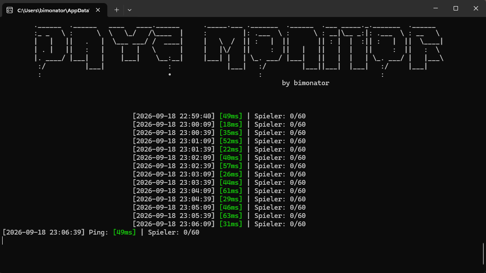
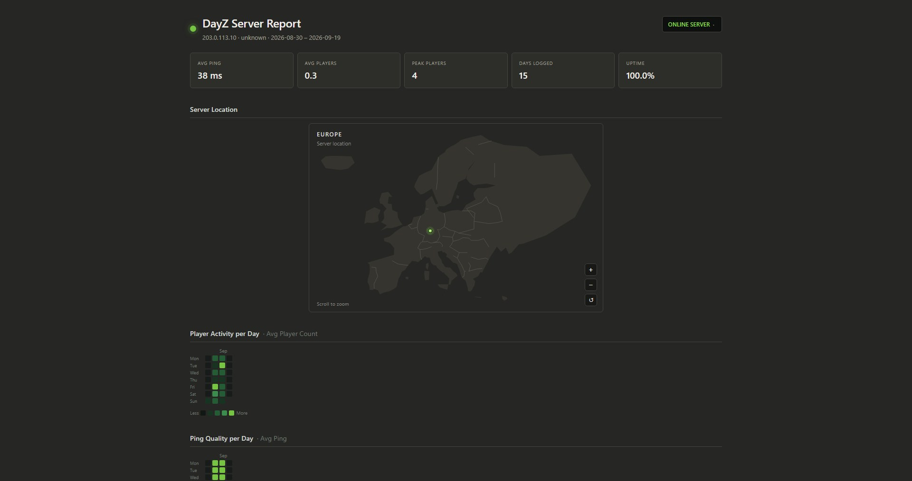
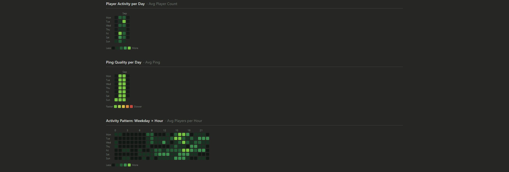

# DayZ Server Monitor

Watches a DayZ game server around the clock, pings you on Discord when players
join or leave, and turns the collected data into a report you can actually look
at. Runs happily on a Raspberry Pi, a spare laptop, or your desktop PC.

No cloud service, no API key, no database. Two files of setup and you're done.

**Two things you need before you start:**

1. The **IP address** of the DayZ server you want to watch.
2. A **Discord webhook URL** (optional — the monitor works without it).

Both are explained step by step below.

---

## What it does

- **Live monitoring** — asks the server every 30 seconds how many players are on
  and how fast it responds (Steam A2S query protocol, same thing the in-game
  server browser uses).
- **Discord notifications** — a message when players join, when players leave,
  and when the server runs empty.
- **Automatic logging** — every check is written to a CSV file, so you build up
  a history without doing anything.
- **HTML report** — heatmaps of when players are online, ping quality, and an
  offline map with your server's location marked. The map picks its region from
  where the server actually is: Europe, North America, Asia or Africa. Opens in
  any browser, works without internet.
- **Activity calendar** — a GitHub-style contribution calendar and a
  weekday/hour heatmap as PNG images.
- **Runs unattended** — set it up once as a system service and forget about it.

---

## Installation

Works on Linux (including Raspberry Pi), macOS and Windows.
You need **Python 3.9 or newer** — Raspberry Pi OS and macOS already have it;
Windows users get it from [python.org](https://www.python.org/downloads/)
(tick **"Add Python to PATH"** during install).

### Step 1 — Download the project

**Linux / macOS / Raspberry Pi**

```bash
git clone https://github.com/bimonator/DayZ-Monitor.git
cd DayZ-Monitor
python3 -m venv venv
source venv/bin/activate
pip install -r requirements.txt
```

**Windows (PowerShell)**

```powershell
git clone https://github.com/bimonator/DayZ-Monitor.git
cd DayZ-Monitor
python -m venv venv
.\venv\Scripts\Activate.ps1
pip install -r requirements.txt
```

> The `venv` is a private folder for this project's packages so they can't
> collide with anything else on your system. Remember the
> `source venv/bin/activate` (or `.\venv\Scripts\Activate.ps1`) line — you need
> it once per terminal session before running any of the commands below.

### Step 2 — Get your Discord webhook URL

Skip this if you don't want Discord notifications.

1. Open Discord and go to the server where you want the messages.
2. **Server Settings → Integrations → Webhooks → New Webhook**
3. Pick the channel the messages should go to and give it a name.
4. Click **Copy Webhook URL**.

You now have a URL that looks like this:

```
https://discord.com/api/webhooks/123456789012345678/AbCdEf-GhIjKlMnOpQrStUv...
```

> Treat that URL like a password — anyone who has it can post in your channel.
> It is stored in `dayz_monitor.config`, which is excluded from git on purpose,
> so it will never end up in a commit.

### Step 3 — Run the setup wizard

```bash
python setup.py
```

It asks you four things and writes the configuration file for you:

| Question | What to enter |
|---|---|
| Server IP address | The IP you use to connect to the server in DayZ, e.g. `203.0.113.10` |
| Query port | Just press Enter. The wizard finds the right one by itself |
| Poll interval | Just press Enter for every 30 seconds |
| Discord webhook URL | Paste the URL from step 2, or press Enter to skip |

The wizard then **tests everything immediately**: it contacts your server, tells
you if it answered and on which port, and sends a test message to your Discord
channel. If something is wrong, you find out here and not three days later.

Re-run `python setup.py` any time you want to change a setting.





### Step 4 — Start monitoring

```bash
python dayz_monitor.py
```

That's it. You'll see a live view with ping and player count, Discord starts
getting notifications, and `dayz_monitor_log.csv` starts filling up.

Stop it with **Ctrl+C**. Nothing is lost — the log picks up where it left off
the next time you start.

---

## Looking at your data

Let the monitor run for a day or two first, otherwise there's nothing to show.

**The HTML report** — heatmaps, ping stats, server location on a map:

```bash
python dayz_report.py
```

It writes `dayz_report.html` and opens it in your browser.

**The activity calendar** — GitHub-style calendar and weekday/hour heatmap as
PNG files in the `reports/` folder:

```bash
python dayz_analyzer.py
```

Useful extras:

```bash
python dayz_report.py --days 30      # only the last 30 days
python dayz_report.py --no-browser   # just write the file, don't open it
python dayz_report.py --no-geo       # skip the location lookup (no internet needed)
python dayz_report.py --map-region asia   # force a map region instead of
                                          # deriving it from the server
```

---

## Running it 24/7 on a Raspberry Pi

So the monitor starts with the Pi and restarts itself if it ever crashes.
A ready-made service file is included:

1. Open `dayz-monitor.service.example` and replace `pi` with your own Linux
   username (it appears three times).
2. Install and start it:

```bash
sudo cp dayz-monitor.service.example /etc/systemd/system/dayz-monitor.service
sudo systemctl daemon-reload
sudo systemctl enable --now dayz-monitor
```

Check on it any time:

```bash
systemctl status dayz-monitor     # is it running?
journalctl -u dayz-monitor -f     # watch the live output
sudo systemctl restart dayz-monitor
```

---

## Something's not working

| What you see | What to do |
|---|---|
| `No configuration found yet` | You skipped step 3. Run `python setup.py`. |
| `Could not reach the server at ...` | The IP is wrong, the server is offline, or the query port is unusual. Look your server up on [BattleMetrics](https://www.battlemetrics.com/) — it shows the correct query port — and re-run `python setup.py` with it. |
| `The 'python-a2s' package is missing` | The venv isn't active or the install didn't run. Activate it (`source venv/bin/activate`) and run `pip install -r requirements.txt`. |
| Discord stays silent | Re-run `python setup.py`. It sends a test message and tells you exactly what Discord replied. A deleted webhook returns `404`. |
| `No data found in dayz_monitor_log.csv` | The monitor hasn't collected anything yet. Let `dayz_monitor.py` run for a while first. |
| `python: command not found` | Try `python3` instead of `python`. |
| `Activate.ps1 cannot be loaded` (Windows) | Run once in PowerShell: `Set-ExecutionPolicy -Scope CurrentUser RemoteSigned` |
| Report says "unknown" as the location | The geolocation lookup couldn't reach the internet, or your provider's IP isn't in the database. Everything else in the report still works. |
| Wrong continent on the map | The region comes from the geo-IP lookup, and some provider IPs are registered in the wrong place. Override it with `python dayz_report.py --map-region north_america`. |
| Map shows a continent but no land under the marker | Your server sits outside the four built-in regions (South America, Oceania). The map zooms out to keep the marker visible; add your own region (see *The map* below). |

---

## The map

The server location panel draws a plain SVG map — no Leaflet, no tiles, no
requests at runtime. The outlines live in the Python code as lon/lat lists, so
the report stays a single self-contained HTML file you can open on a machine
with no internet at all.

Four regions ship with it, and the one you get follows your server:

| Region | Covers | Picked for a server in |
|---|---|---|
| `europe` | Iceland to the Urals, hand-drawn | Falkenstein, Amsterdam, Warsaw |
| `north_america` | Alaska to Panama, plus the Caribbean | Dallas, Montreal, Los Angeles |
| `asia` | Turkey to Japan, down to Indonesia | Tokyo, Singapore, Mumbai |
| `africa` | the whole continent plus Madagascar | Johannesburg, Lagos, Cairo |

The region is chosen from the geo-located coordinates: whichever region's
landmass the server sits on wins, and when regions overlap (Istanbul is in both
Europe and Asia) the tighter one wins because it shows more detail. A server
outside all four still gets a marker — the map just zooms out far enough to keep
it in frame. To override the choice, pass `--map-region`.

### Adding your own region

`dayz_map_data.py` is generated, so don't edit it by hand. Instead:

1. Download the Natural Earth *admin 0 countries* (1:10m) GeoJSON, e.g. from
   [datasets/geo-countries](https://raw.githubusercontent.com/datasets/geo-countries/master/data/countries.geojson).
2. Add an entry to `REGIONS` in `tools/build_map_data.py` — a name, a lon/lat
   bounding box, a reference parallel for the projection, and how aggressively
   to simplify.
3. Rebuild:

```bash
python tools/build_map_data.py --geojson countries.geojson
```

The script dissolves the country polygons into one landmass (so no seams show
inside the fill), keeps the shared edges as land borders, clips everything to
your box, and simplifies it down to a few thousand points. Europe stays
hand-drawn unless you add a `europe` entry, which then overrides it.

---

## Configuration

`setup.py` writes `dayz_monitor.config`. You can also edit it by hand — it's
plain JSON:

```json
{
  "ip": "203.0.113.10",
  "port": 2302,
  "interval": 30,
  "webhook": "https://discord.com/api/webhooks/YOUR_WEBHOOK_ID/YOUR_WEBHOOK_TOKEN"
}
```

| Key | Meaning |
|---|---|
| `ip` | Your DayZ server's IP address |
| `port` | Query port. If it's wrong, the monitor tries nearby ports automatically |
| `interval` | Seconds between checks (30 is a good value) |
| `webhook` | Discord webhook URL, or `""` for no notifications |

Every value can also be passed on the command line, which takes priority over
the config file:

```bash
python dayz_monitor.py --ip 203.0.113.10 --port 27016 --interval 60
python dayz_monitor.py --webhook https://discord.com/api/webhooks/...
```

`python dayz_monitor.py --help` lists all options.

---

## What's in the box

```
.
├── setup.py                     # The setup wizard — start here
├── dayz_monitor.py              # The monitor: queries the server, logs, notifies Discord
├── dayz_report.py               # Builds the HTML report with maps and heatmaps
├── dayz_map_data.py             # Generated map outlines (North America, Asia, Africa)
├── tools/build_map_data.py      # Rebuilds dayz_map_data.py from a Natural Earth GeoJSON
├── dayz_analyzer.py             # Builds the PNG activity calendar and heatmap
├── dayz-monitor.service.example # systemd template for running it 24/7
├── dayz_monitor.config.example  # Config template, if you'd rather not use the wizard
└── requirements.txt             # The Python packages needed
```

These are created while running and are **not** part of the repository:
`dayz_monitor.config` (contains your webhook), `dayz_monitor_log.csv`,
`dayz_report.html`, `.dayz_location_cache.json` and `reports/`.

### A note on privacy

The monitor only ever reads what the server publishes to anyone: player count,
maximum slots, server name and response time. It does **not** collect player
names or track individual players. The one geolocation lookup is for the
**server's own IP**, so the report can put a dot on the map, and the result is
cached locally so it only happens once.

---

## Roadmap

- [ ] Push the HTML report to Discord as a file attachment
- [ ] `cron` job for an automated daily report
- [x] Real-world geodata (Natural Earth) for the map
- [ ] More regions: South America, Oceania
- [ ] Hover tooltips and marker popups on the map
- [ ] Pinch-to-zoom on mobile
- [ ] `journald` spam guard for the screen-clearing redraws
- [ ] Multi-week trend views
- [ ] PDF export of reports

## License

MIT — see [LICENSE](LICENSE). Do what you like with it.
